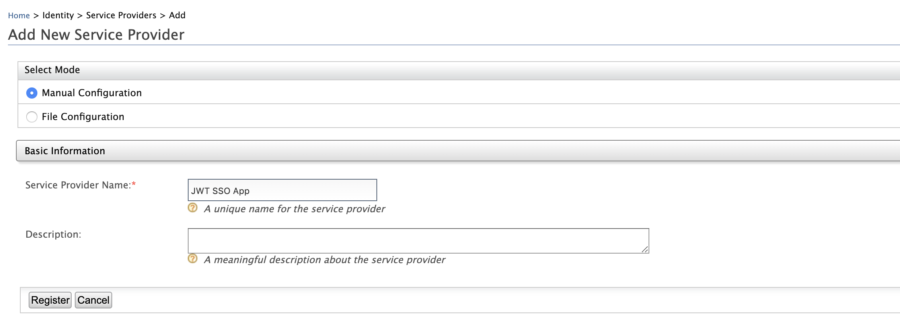
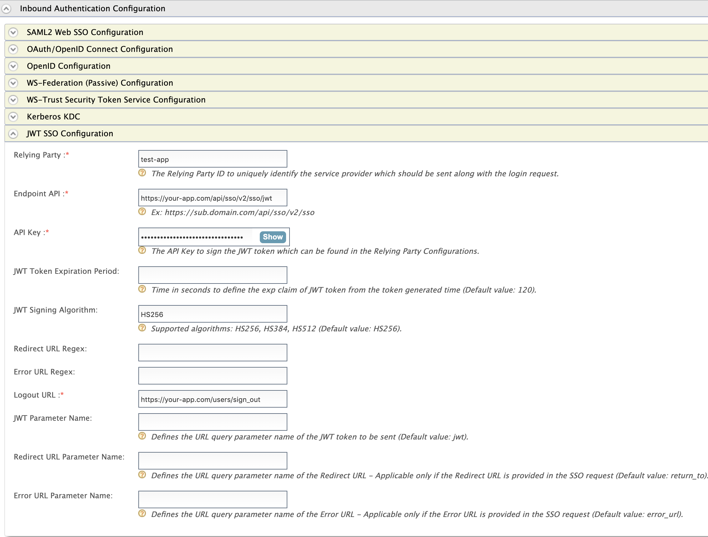
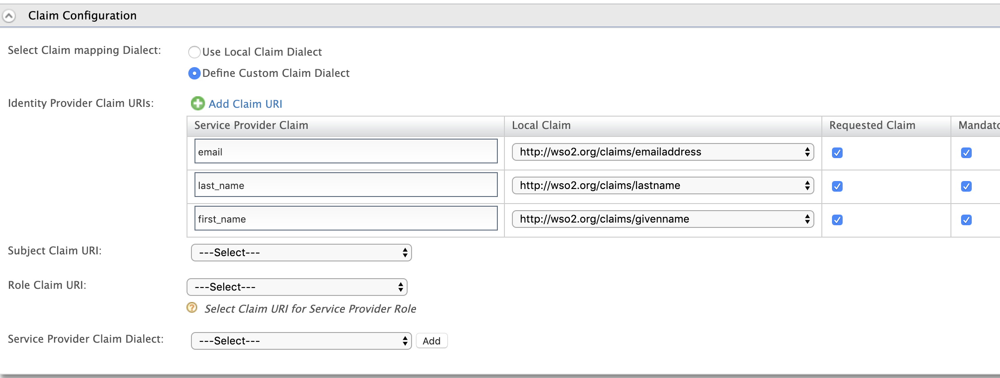
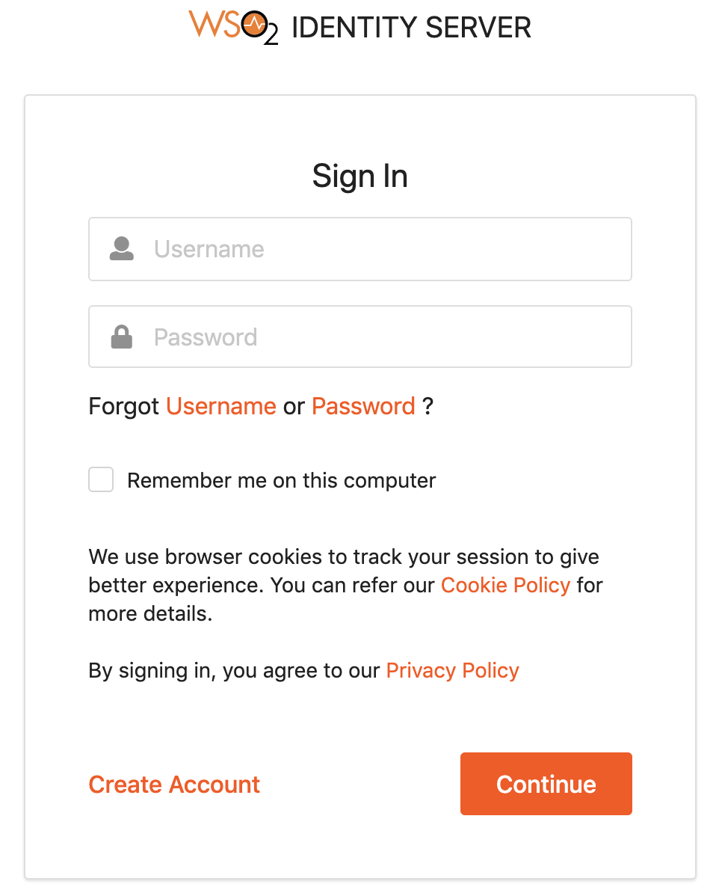

# Configuring JWT SSO Inbound Authenticator

This topic provides instructions on configuring the JWT SSO inbound authenticator and the WSO2 Identity Server 
to perform single-sign-on with the applications which use JWT-based SSO.

````
JWT SSO Version 1.0.0 Inbound Authenticator is supported by WSO2 Identity Server versions 5.10.0. 
````

* [Download and set up JWT SSO](#download-and-set-up-jwt-sso)
* [Configuring the application](#configuring-the-application)
* [Deploying JWT SSO artifacts](#deploying-jwt-sso-artifacts)
* [Configuring the service provider](#configuring-the-service-provider)
* [Testing the JWT SSO](#testing-the-jwt-sso)
* [Customizing the application](#customizing-the-application)

### Download and set up JWT SSO

* [Download WSO2 Identity Server](https://wso2.com/identity-and-access-management) and
[Install the Product](https://is.docs.wso2.com/en/latest/setup/installing-the-product).
* Download the JWT SSO Inbound Authenticator JAR from the 
[IS Connector store](https://github.com/mifrazmurthaja/identity-inbound-auth-jwtsso/releases).

### Configuring the application

1. Enable JWT SSO on your application. Refer to your application's documentation for instructions on enabling JWT SSO
 for your application.
2. Get the configuration details of the application by signing into the admin portal or referring to the
 documentation of your application.
    * Endpoint API
    * API key
    * Logout URL (The URL to be redirected to after the successful logout)
    * JWS algorithm (Optional, Default: HS256)
    * JWT parameter name (Optional, Default: jwt)
    * Redirect URL parameter name (Optional, Default: return_to)
    * Error URL parameter name (Optional, Default: error_url)

### Deploying JWT SSO artifacts

1. Place the ``org.wso2.carbon.identity.sso.jwt-x.x.x.jar`` file into the ``<IS_HOME>/repository/components/dropins``
 directory.
2. Add the configuration below in ``deployment.toml`` file resides in ``<IS_HOME>/repository/conf`` directory.
    ````
    [[resource.access_control]]
    context="/identity(.*)"
    secure="false"
    http_method="GET"
    ````
3. [Start/ Restart the WSO2 Identity Server](https://is.docs.wso2.com/en/latest/setup/running-the-product).

### Configuring the service provider

Let's configure the WSO2 Identity Server to use JWT SSO by
[adding a new Service Provider](https://is.docs.wso2.com/en/latest/learn/adding-and-configuring-a-service-provider).

1. Log in to the
[management console](https://is.docs.wso2.com/en/latest/setup/getting-started-with-the-management-console) as an
administrator.
2. In the **Identity** section under the Main tab, click **Add** under **Service Providers**.
3. Enter a name for the service provider in the **Service Provider Name** text box and click **Register**.

4. In the **Inbound Authentication Configuration** section, click **JWT SSO Configuration**.
5. Enter **test-app** for **Relying Party** and enter the **Endpoint API** and the **API Key** which you've
 obtained from your application.

6. Enter the **Logout URL** to which the user should be redirected after the successful logout.
7. Refer below for the properties used in the JWT SSO inbound authenticator and the sample values related to those
 properties.
    | Field | Description | Default Value | Sample Value |
    | --- | --- | --- | --- |
    | Relying Party | The name of the relying party. This will be needed when we perform authentication request. |  | test-app |
    | Endpoint API | The endpoint where the JWT response should be sent to after authenticating the user. |  | https://your-app.com/api/sso/v2/sso/jwt |
    | API Key | The API Key used to sign the JWT token. |  | xxxxxxxxxxxxxxxxxxxxxxxxxxxxxxxx |
    | JWT Token Expiration Period | The token expiration (exp) to be set. | 120 | 60 |
    | JWT Signing Algorithm | The JWS Algorithm used to sign the token. | HS256 | Supported Algorithms: HS256/ HS384 / HS512 |
    | Redirect URL Regex | The regex to validate the Redirect URL. |  | https://your-app.com/.* |
    | Error URL Regex | The regex to validate the Error URL. |  | https://your-app.com/.* |
    | Logout URL | The logout URL to be redirected to after the successful logout in WSO2 IS. |  | https://your-app.com/users/sign_out |
    | JWT Parameter Name | The JWT parameter name to be used to send the JWT token after authenticating the user. | jwt | jwt |
    | Redirect URL Parameter Name | The Redirect URL parameter name to be used to include the Redirect URL. | return_to | return_to |
    | Error URL Parameter Name | The Error URL parameter name to be used to include the Error URL. | error_url | error_url |
8. Go to **Claim Configuration** and click **Define Custom Claim Dialect** to define the claims to generate the JWT
 token. (This is required to include the user claims in the JWT token; otherwise, no attributes will be included in
 the JWT token apart from the default attributes such as exp and iat.) Add the **Service Provider Claim** name that
 corresponds to the **Local Claim** URI and mark it as **Requested Claim** and **Mandatory Claim**. You need to refer to
 your application's documentation to get the required claims for the service provider. 

8. Click **Update** to save the changes. Now you have configured the service provider.

### Testing the JWT SSO

1. To test the above configured JWT SSO application, let’s make an authentication request to WSO2 Identity Server as
 follows.
    ````
    https://localhost:9443/identity/jwtsso?jwtRP=test-app
    ````
2. Login to the WSO2 Identity Server by providing the username and password in the basic authentication.

3. Once you've successfully logged in or if you already have an authenticated session in WSO2 Identity Server, you
 should be redirected to your application's home page or to the Redirect URL specified.
4. Let’s test the logout flow by making the request to JWT SSO logout endpoint as follows.
    ````
    https://localhost:9443/identity/jwtsso/logout?jwtRP=test-app
    ````
5. Once you make the above request, your session will be terminated from WSO2 Identity Server and you'll be
 redirected back to the Logout URL of your application configured in the service provider configurations.
 
### Customizing the application

Customize your application to use WSO2 Identity Server for authentication by referring to your application's
 documentation.
 
1. Define the URL below for the Sign In button of your application.
    ````
    https://localhost:9443/identity/jwtsso?jwtRP=test-app
    ````
2. Configure the URL below for the logout functionality of your application.
    ````
    https://localhost:9443/identity/jwtsso/logout?jwtRP=test-app
    ````